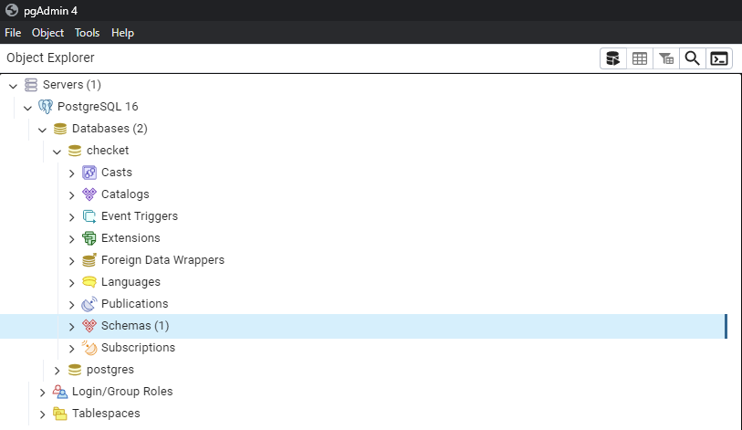
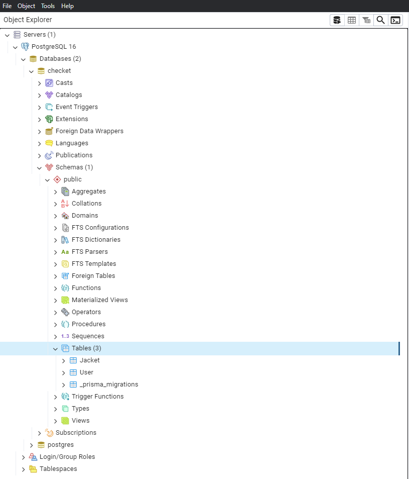
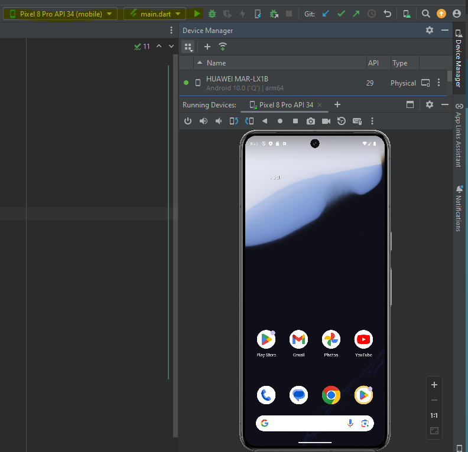

# Checket Mobile Anwendungen

## Table of Contents

1. [Installation](#1-installation)
   - [Flutter](#11-flutter)
   - [NodeJS](#12-nodejs)
   - [Postgres with Prisma](#13-postgres-with-prisma)
2. [Start the App](#2-start-the-app)
   - [Android Studio Emulator](#21-androidstudio-emulator)
   - [On Own Device](#22-on-own-device)
3. [Reports](#3-reports)

## 1. Installation

After cloning the repository, follow these steps:

### 1.1 Flutter

Follow the instructions on the [Flutter get started page](https://docs.flutter.dev/get-started/editor).

### 1.2 NodeJS

1. Use the command line to navigate to the server directory:
   ```sh
   cd /server
   ```
2. Install the Express.js package by running the following command:
   ```sh
   npm install express
   ```

### 1.3 Postgres with Prisma

1. Download Postgres for your OS (PostgreSQL Version 16.3 recommended).
2. [Here is the link to the installer](https://www.enterprisedb.com/downloads/postgres-postgresql-downloads).
3. Follow the installation guide and complete it. Be aware that pgAdmin4 is checked at installation process.
4. Remember your credentials for pgAdmin4.
5. Open pgAdmin4 and create a new database called `checket`.

   

6. Use the command line to navigate to the prisma directory:
   ```sh
   cd prisma
   ```
7. Map your data model to the database schema using the Prisma migrate CLI commands:
   ```sh
   npx prisma migrate dev --name init
   ```
8. Check if the tables are created in pgAdmin4.

   

9. If all tables are there, you're good to go!

10. change the directory to server and start the node server with the following command:
  ```sh
  cd ..
  node server.js
  ```

## 2. Start the App

Check the ip-address in `utils.dart` file located at `/app/lib/utils/utils.dart`. Change it to your 
own ip-address if necessary under `// Default Emulator` for Android Studio Emulator or at 
`// Physical Device` for your own device.
   ```dart
   // final String ip = "10.0.2.2"; // Default Emulator
   final String ip = "192.168.0.71"; // Physical Device
   ```

### 2.1 Android Studio Emulator

1. Choose a virtual device under Device Manager and create a new one.
2. Start the virtual device.
3. Select the virtual device in the run configurations as well as the `main.dart` file 
located at `/app/lib/main.dart`.

   

4.Register a new user with the registration form and then log in with those credentials.
5.Have fun with the app!

### 2.2 Physical Device

1. Connect your Phone to the PC and enable USB-Debugging in the Developer Tools on your Phone.
2. Select physical device under Device Manager - Your connected phone should show up there
3. Change the IP address to the IP address of your physical device and comment out the default emulator IP address
4. Remember to change it back when using the Android Studio Emulator!
5. Have fun with the app!

## 3. Reports

The reports generated when you log out can be found in the following paths:

- For Android Studio Emulator:
  ```sh
  /storage/emulated/0/Android/data/com.example.app/files/Reports
  ```
- Physical Device:
  ```sh
  Android/data/com.example.app/files/Reports
  ```